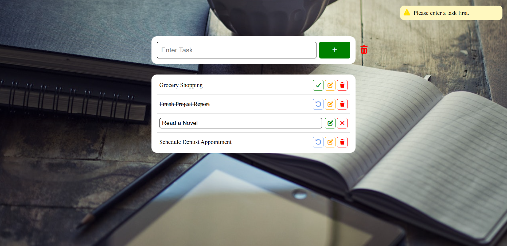

# To Do List 📝

A small JavaScript project that implements a to-do list where users can create, mark as completed, undo mark, and delete tasks using basic DOM manipulation.

## Key Concepts Used 🧩

- `document.querySelector()`
- `addEventListener()`
- `createElement()`
- `remove() & add()`
- `appendChild()`
- `innerHTML & innerText`
- `parentElement`
- `e.target`

## Programming Languages Used 🛠️

- HTML
- CSS
- JavaScript

## Screenshot 📸

